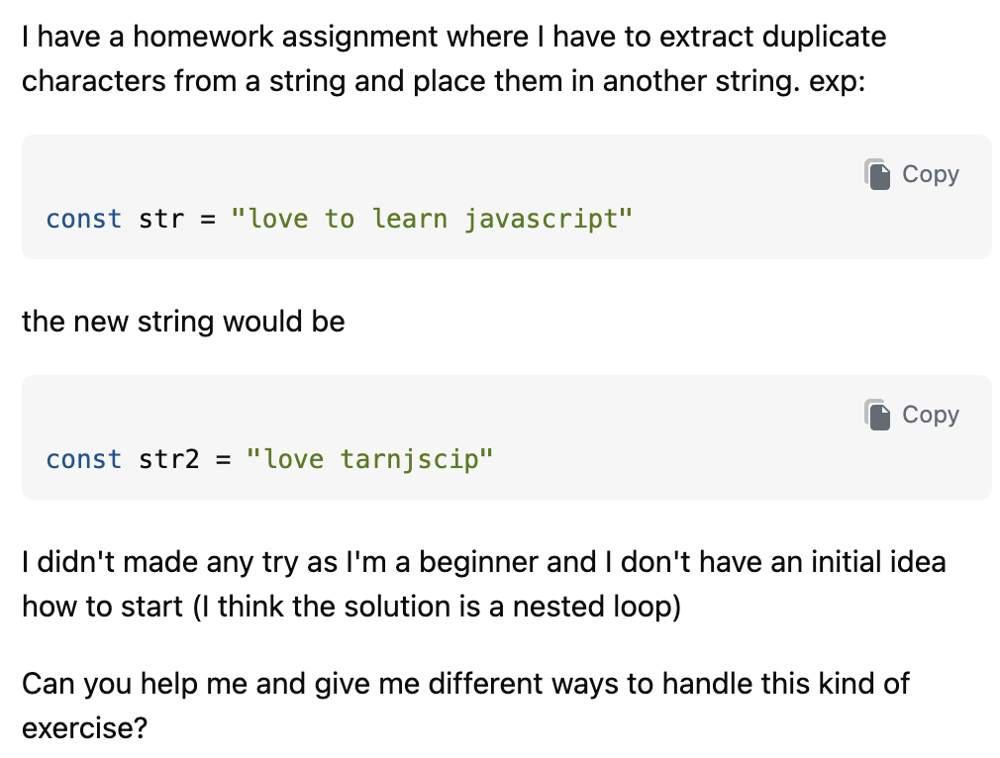

## Why Smart Questions Matter

  Software engineering is often described as a technical field, but technical knowledge alone is not enough to become an effective software engineer. Programmers spend a significant amount of time communicating with other people: teammates, users, documentation authors, maintainers, and online communities. One of the most important forms of this communication is asking for help. A programmer may have excellent technical ability but still waste considerable time if they cannot explain a problem clearly enough for another person to understand and reproduce it.
  
  Eric Raymond's essay, "[How to Ask Questions the Smart Way](http://www.catb.org/esr/faqs/smart-questions.html)," provides a useful tool for thinking about this problem. Raymond argues that the quality of the answer someone receives depends significantly on the quality of the question. His recommendations include doing research before asking, describing the problem precisely, reporting relevant issues rather than blind assumptiobns, providing enough information to reproduce the problem, stating the desired result, and making the question easy for another person to answer. 

  Stack Overflow provides an excellent environment for seeing these principles in practice. The contrast between a well-constructed question and a poorly constructed one demonstrates that asking questions is itself an important skill. The two questions examined below show how the amount and organization of information supplied by the person asking the question can directly affect the efficiency and usefulness of the community's response.

## What Exactly is a Smart Question?

  Raymond's central idea is that asking for technical help should not be treated as simply demanding that somebody else solve a problem. Before asking, a programmer should search existing resources, experiment, inspect documentation, and attempt to isolate the problem. When the question is finally posted, the question should demonstrate this effort. Raymond specifically recommends being precise and informative, describing symptoms rather than guesses, explaining the desired outcome, and providing a reproducible example when code is involved. 

  A smart question therefore reduces the amount of work required from the person answering it. Instead of making an expert reconstruct the entire situation, the question provides the relevant facts up front. This does not mean that a good question must be long. In fact, a good question can be quite short if it contains the right information.

# Case Study Not-So-Smart Question 

The Stack Overflow question "[extract duplicate characters from a string](https://stackoverflow.com/questions/76677968/extract-duplicate-characters-from-a-string)" is a good example of a question that does not follow Eric Raymond's guidelines for asking questions the smart way. The question was posted by a beginner asking for help with a JavaScript homework assignment. The author explains that they need to extract duplicate characters from a string and put them into another string. They provide the example "love to learn javascript" and state that the resulting string should be "love tarnjscip". However, the author also explicitly says, "I didn't made any try as I'm a beginner and I don't have an initial idea how to start."

The Question:

This question is particularly interesting because the problem is not simply that the author is a beginner. Beginners are absolutely encouraged to ask questions. The larger problem is that the author has not yet attempted to solve the problem or sufficiently clarified what the desired result actually means. These issues conflict with several of Raymond's recommendations.

One of Raymond's most important recommendations is to try to solve the problem before asking someone else for help. He argues that a question should demonstrate that the person asking has made a reasonable effort to investigate the problem. In this case, the author openly states that they have made no attempt to solve the problem. They speculate that a nested loop might be necessary, but they do not show any code or explain what they tried. Furthermore, several characters in that output occur only once in the original string. This ambiguity was noticed by multiple answerers. One commenter specifically points out that the result contains characters that were used only once. Another answerer acknowledges that the description and example do not really match. This is a major violation of the principle of being precise. A programmer trying to answer the question has to determine what the author actually means before determining how to solve it.

At the same time, the question did receive five answers, so it would be inaccurate to claim that asking a question this way produces no useful help. In fact, the community provided several useful solutions. The better conclusion is that the question produced less efficient and less focused help than it could have. The answerers had to compensate for shortcomings in the original question.

That distinction fits the purpose of the assignment particularly well. Raymond's principles do not guarantee that a smart question will receive a good answer or that a poorly written question will receive no answer. Instead, they help maximize the likelihood that other programmers can understand the problem quickly and provide an answer that addresses the questioner's actual difficulty.

This example therefore demonstrates an important lesson: the responsibility for communicating a programming problem clearly belongs primarily to the person asking the question. If the programmer has not determined what the expected behavior actually is, has not attempted a solution, and cannot explain where the attempt failed, the people trying to help must first solve the communication problem before they can solve the programming problem.

For a software engineer, learning to avoid this situation is valuable. The process of defining the expected behavior, attempting a solution, identifying the failure, and communicating that failure precisely is not just good Stack Overflow etiquette, it is good software engineering.

# Case Study: Smart Question 

An example of a relatively smart Stack Overflow question is "[How can I know which junit-jupiter supports Java 8?](https://stackoverflow.com/questions/76677968/extract-duplicate-characters-from-a-string)." The developer explains that they are working with Java 8 and are trying to determine which version of JUnit Jupiter is compatible. They provide their build.gradle, a small test class, the JUnit dependency they tried, and the complete Gradle error showing that the JUnit Platform could not be loaded. They also explain what they have already investigated and why they are confused about the relationship between JUnit versions and Java versions. This follows several of Eric Raymond's recommendations because the author gives specific technical context, includes relevant code and error output, and describes both what they are trying to accomplish and what they have already attempted. 

The question is especially useful as a "smart question" example because the author does not simply ask, “Which JUnit version should I use?” Instead, they explain the reasoning behind the question and provide evidence from their actual project. For example, they explain that JUnit 6 requires Java 17, that they are intentionally staying on Java 8, and that they tried JUnit 5.10.1 but encountered a Gradle test-executor error. This givesenough information to distinguish between Java/JUnit version compatibility and the missing JUnit Platform launcher. The response was therefore able to address the actual problem rather than asking the author for basic information first. The answer explains that JUnit 5.x supports Java 8, while JUnit 6 requires Java 17, and then identifies the missing launcher dependency as the reason the test executor failed. 

Although the question was later closed, I would still consider it a useful example of a smart question. The person asking the question did many things Raymond recommends: they showed their work, provided the relevant environment and configuration, included the exact error message, and explained their desired outcome. The resulting discussion also produced a specific and educational answer rather than a vague suggestion. The main takeaway is that smart questions reduce the amount of guessing a person asnwering must do. Instead of making the community reconstruct the problem, the developer supplied enough evidence for the responder to diagnose the situation and explain both the immediate fix and the underlying issue.

# Why This Matters for Software Engineers and Insights 

Smart questions matter because software development is rarely an individual activity. Even when a programmer is working alone, they depend on documentation, libraries, open-source projects, search engines, colleagues, and developer communities. The ability to communicate a problem efficiently therefore directly affects productivity.

A poorly constructed question transfers unnecessary work to the person being asked for help. The answerer must first determine what the problem actually is, what the desired behavior should be, what environment is involved, and which portions of the code matter. Sometimes the answerer has to ask several follow-up questions before meaningful debugging can begin. The most important insight I gained from comparing these questions is that the quality of a question is determined by how much detail the author puts into it. Before this comparison, it would be easy to think that a "good question" simply means being polite and providing a lot of code, but the smart questions format helps create even better questions.

Note: CHATGPT was used to polish my work slightly by helping with grammar and formatting. 

  
